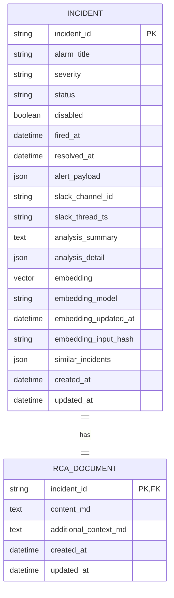

아래 ERD는 계획(to-be) 기준이며, 현재 DB는 미구현입니다.

```mermaid
erDiagram
  INCIDENT ||--|| RCA_DOCUMENT : has

  INCIDENT {
    string incident_id PK
    string alarm_title
    string severity
    string status
    boolean disabled
    datetime fired_at
    datetime resolved_at

    json alert_payload

    string slack_channel_id
    string slack_thread_ts

    text analysis_summary
    json analysis_detail

    vector embedding
    string embedding_model
    datetime embedding_updated_at
    string embedding_input_hash

    json similar_incidents

    datetime created_at
    datetime updated_at
  }

  RCA_DOCUMENT {
    string incident_id PK,FK
    text content_md
    text additional_context_md
    datetime created_at
    datetime updated_at
  }
```
