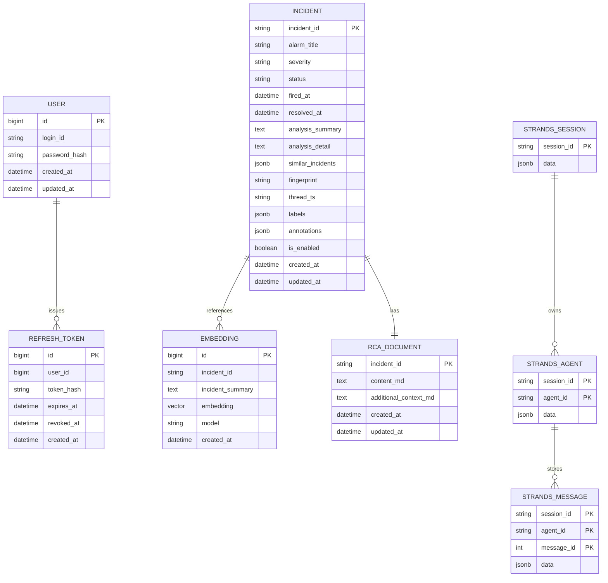

아래 ERD는 현재 구현과 계획을 함께 표현합니다.
- users/refresh_tokens: 구현 (AuthService에서 스키마 생성)
- incidents/embeddings: 구현 (알림 저장/분석 결과/임베딩)
- strands_sessions/strands_agents/strands_messages: 구현 (Agent 세션 저장)
- RCA_DOCUMENT: 계획

