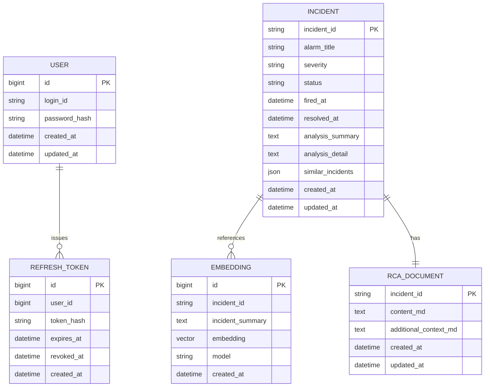

아래 ERD는 현재 구현과 계획을 함께 표현합니다.
- users/refresh_tokens: 구현 (AuthService에서 스키마 생성)
- incidents/embeddings: 코드에서 조회/삽입에 사용
- RCA_DOCUMENT: 계획

```mermaid
erDiagram
  USER ||--o{ REFRESH_TOKEN : issues
  INCIDENT ||--o{ EMBEDDING : references
  INCIDENT ||--|| RCA_DOCUMENT : has

  USER {
    bigint id PK
    string login_id
    string password_hash
    datetime created_at
    datetime updated_at
  }

  REFRESH_TOKEN {
    bigint id PK
    bigint user_id
    string token_hash
    datetime expires_at
    datetime revoked_at
    datetime created_at
  }

  INCIDENT {
    string incident_id PK
    string alarm_title
    string severity
    string status
    datetime fired_at
    datetime resolved_at
    text analysis_summary
    text analysis_detail
    json similar_incidents
    datetime created_at
    datetime updated_at
  }

  EMBEDDING {
    bigint id PK
    string incident_id
    text incident_summary
    vector embedding
    string model
    datetime created_at
  }

  RCA_DOCUMENT {
    string incident_id PK
    text content_md
    text additional_context_md
    datetime created_at
    datetime updated_at
  }
```
