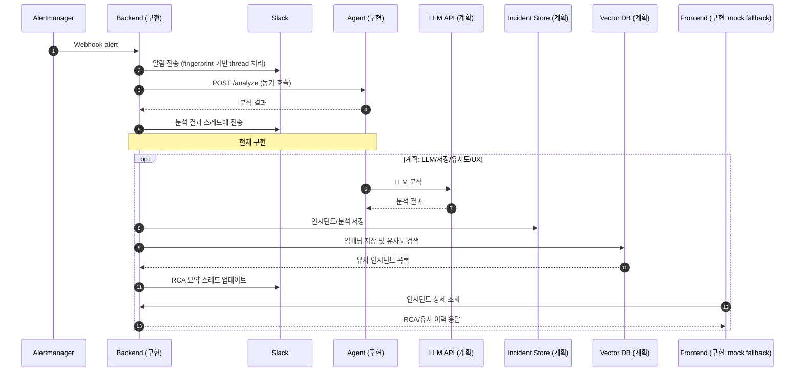

```mermaid
sequenceDiagram
  autonumber
  participant AM as Alertmanager
  participant BE as Backend (구현)
  participant SL as Slack
  participant AG as Agent (구현)
  participant LLM as LLM API (계획)
  participant DB as Incident Store (계획)
  participant VDB as Vector DB (계획)
  participant FE as Frontend (구현: mock fallback)

  AM->>BE: Webhook alert
  BE->>SL: 알림 전송 (fingerprint 기반 thread 처리)
  BE->>AG: POST /analyze (동기 호출)
  AG-->>BE: 분석 결과
  BE->>SL: 분석 결과 스레드에 전송
  Note over BE,AG: 현재 구현

  opt 계획: LLM/저장/유사도/UX
    AG->>LLM: LLM 분석
    LLM-->>AG: 분석 결과
    BE->>DB: 인시던트/분석 저장
    BE->>VDB: 임베딩 저장 및 유사도 검색
    VDB-->>BE: 유사 인시던트 목록
    BE->>SL: RCA 요약 스레드 업데이트
    FE->>BE: 인시던트 상세 조회
    BE-->>FE: RCA/유사 이력 응답
  end
```
