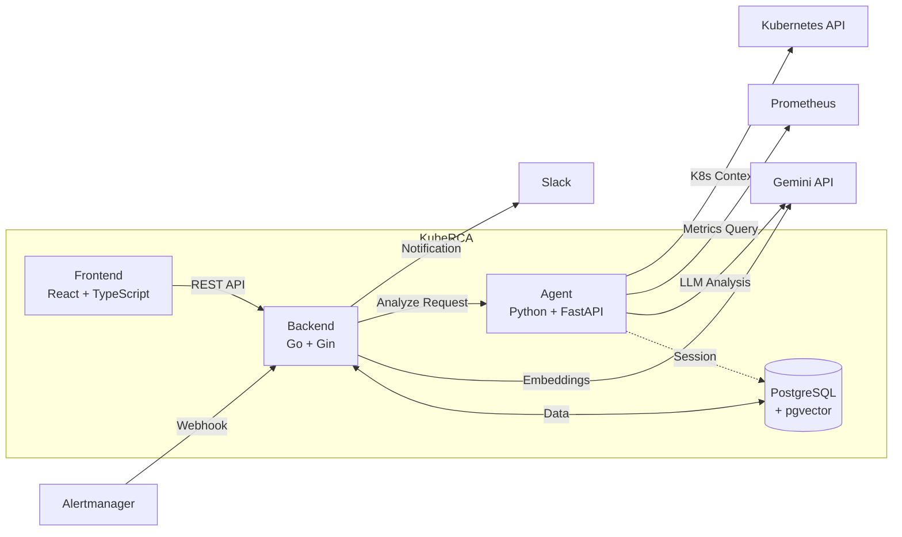

<p align="center">
  
</p>

<h1 align="center">KubeRCA</h1>

<p align="center">
  <strong>AI-Powered Kubernetes Incident Analysis & Root Cause Analysis Tool</strong>
</p>

<p align="center">
  
  
  
  
  
</p>

---

## Overview

KubeRCA is an open-source tool that automatically collects incident context from Kubernetes environments and provides **Root Cause Analysis (RCA)** and response guides using LLM.

When alerts fire in your cluster, KubeRCA:
1. Receives alerts via Alertmanager webhook
2. Collects relevant logs, metrics, and Kubernetes events
3. Analyzes the context using AI (Gemini/Strands Agents)
4. Provides RCA summaries and recommended actions
5. Searches similar past incidents for reference

---

## Features

- **Automated Context Collection** - Gather logs, metrics, and K8s events when alerts fire
- **AI-Powered Analysis** - LLM-based root cause analysis with Strands Agents (Gemini)
- **Similar Incident Search** - Vector similarity search using pgvector
- **Slack Integration** - Real-time notifications with threaded analysis results
- **Web Dashboard** - React-based UI for incident management
- **Helm Deployment** - Easy installation via Helm charts

---

## Architecture



### Component Flow

| Step | Description |
|------|-------------|
| 1 | Alertmanager sends alerts to Backend via webhook |
| 2 | Backend creates/updates Incident and stores Alert |
| 3 | Backend sends Slack notification (with thread tracking) |
| 4 | Backend requests analysis from Agent (async) |
| 5 | Agent collects K8s/Prometheus context |
| 6 | Agent performs LLM analysis via Strands Agents |
| 7 | Backend stores analysis results and sends to Slack thread |
| 8 | Frontend displays incidents with similar incident search |

---

## Tech Stack

### Application
| Component | Technology |
|-----------|------------|
| **Backend** | Go 1.24 + Gin |
| **Agent** | Python 3.10+ + FastAPI + Strands Agents |
| **Frontend** | React 18 + TypeScript + Vite + Tailwind CSS |
| **Database** | PostgreSQL + pgvector |

### Infrastructure & Observability
| Category | Technology |
|----------|------------|
| **Deployment** | Helm, ArgoCD |
| **IaC** | Terraform |
| **Monitoring** | Prometheus, Alertmanager, Grafana |
| **Logging** | Loki, Grafana Alloy |
| **AI/LLM** | Google Gemini API |

### Testing
| Category | Technology |
|----------|------------|
| **Chaos Engineering** | Chaos Mesh |
| **Load Testing** | k6 |

---

## Quick Start

### Prerequisites

- Kubernetes cluster (1.25+)
- Helm 3.x
- PostgreSQL with pgvector extension
- Gemini API key

### Installation via Helm

```bash
# Add the chart repository (if published) or use local charts
helm repo add kube-rca https://your-chart-repo.example.com
helm repo update

# Install with minimal configuration
helm install kube-rca kube-rca/kube-rca \
  --namespace kube-rca \
  --create-namespace \
  --set agent.gemini.secret.existingSecret=your-gemini-secret \
  --set backend.postgresql.host=your-postgres-host
```

### Installation from Source

```bash
# Clone the repository
git clone https://github.com/your-org/kube-rca.git
cd kube-rca/helm-charts

# Install the chart
helm install kube-rca charts/kube-rca \
  --namespace kube-rca \
  --create-namespace \
  -f your-values.yaml
```

### Minimal values.yaml Example

```yaml
# Backend configuration
backend:
  postgresql:
    host: "postgresql.kube-rca.svc.cluster.local"
    database: "kube-rca"
    user: "kube-rca"
    secret:
      existingSecret: "postgresql"
      key: "password"
  slack:
    enabled: true
    secret:
      existingSecret: "kube-rca-slack"
  auth:
    admin:
      username: "admin"
      password: "changeme"

# Agent configuration
agent:
  gemini:
    secret:
      existingSecret: "kube-rca-ai"
      key: "ai-studio-api-key"
  prometheus:
    url: "http://prometheus-server.monitoring:9090"

# Frontend configuration
frontend:
  ingress:
    enabled: true
    hosts:
      - kube-rca.example.com
```

### Configure Alertmanager

Add the KubeRCA webhook receiver to your Alertmanager configuration:

```yaml
receivers:
  - name: 'kube-rca'
    webhook_configs:
      - url: 'http://kube-rca-backend.kube-rca:8080/webhook/alertmanager'
        send_resolved: true

route:
  receiver: 'kube-rca'
  # or add as a child route
```

---

## Configuration

### Backend Environment Variables

| Variable | Description | Required |
|----------|-------------|----------|
| `DATABASE_URL` | PostgreSQL connection string | Yes |
| `SLACK_BOT_TOKEN` | Slack Bot OAuth token | Yes (if Slack enabled) |
| `SLACK_CHANNEL_ID` | Slack channel for notifications | Yes (if Slack enabled) |
| `JWT_SECRET` | JWT signing secret | Yes |
| `AI_API_KEY` | Gemini API key for embeddings | Yes |
| `AGENT_URL` | Agent service URL | Yes |

### Agent Environment Variables

| Variable | Description | Required |
|----------|-------------|----------|
| `GEMINI_API_KEY` | Gemini API key for Strands Agents | Yes |
| `PROMETHEUS_URL` | Prometheus base URL | No |
| `SESSION_DB_HOST` | PostgreSQL host for session storage | No |

For full configuration options, see the [Helm chart values](../../helm-charts/charts/kube-rca/README.md).

---

## Local Development

### Backend (Go)

```bash
cd backend
go mod tidy
go run .
# or
go test ./...
```

### Agent (Python)

```bash
cd agent
make install   # uv sync
make lint      # ruff check
make test      # pytest
make run       # uvicorn dev server
```

### Frontend (React)

```bash
cd frontend
npm ci
npm run dev    # development server
npm run build  # production build
npm run lint   # eslint
```

---

## Documentation

- [Architecture Details](../ARCHITECTURE.md)
- [Project Background](../PROJECT.md)
- [Helm Chart Values](../../helm-charts/charts/kube-rca/README.md)
- [Sequence Diagrams](../diagrams/)

---

## Contributing

Contributions are welcome! Please read our contributing guidelines before submitting PRs.

1. Fork the repository
2. Create your feature branch (`git checkout -b feature/amazing-feature`)
3. Commit your changes (`git commit -m 'feat: add amazing feature'`)
4. Push to the branch (`git push origin feature/amazing-feature`)
5. Open a Pull Request

---

## License

This project is licensed under the Apache License 2.0 - see the [LICENSE](../../LICENSE) file for details.

---

<p align="center">
  Made with dedication for the Kubernetes community
</p>
