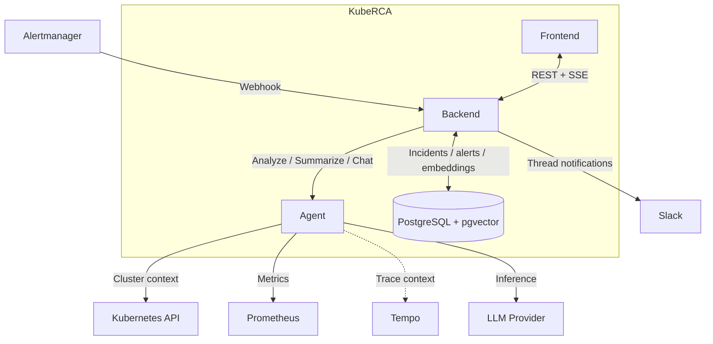

<p align="center">
  
</p>

<h1 align="center">KubeRCA</h1>

<p align="center">
  <strong>AI-powered Kubernetes incident analysis and Root Cause Analysis</strong>
</p>

<p align="center">
  <a href="https://github.com/kube-rca/kuberca/blob/main/LICENSE"></a>
  <a href="https://github.com/kube-rca/kuberca/releases"></a>
  <a href="https://github.com/kube-rca/kuberca/stargazers"></a>
  <a href="https://github.com/kube-rca/kuberca/actions/workflows/ci-backend.yaml"></a>
  
  
  
  
</p>

<p align="center">
  <em>Turn Kubernetes alerts into actionable root-cause analysis — in seconds, not hours.</em>
</p>

> ⭐ <strong>If KubeRCA looks useful, please consider starring the <a href="https://github.com/kube-rca/kuberca">main repository</a>.</strong> It helps the project reach more operators and brings in more contributors.

---

## See It In Action

A few screens from a running KubeRCA install. Dashboards correlate alerts to incidents, and every incident gets an LLM-generated RCA summary that lands in Slack and the UI together.

### Incident Dashboard

<p align="center">
  
</p>

### Alert Dashboard

<p align="center">
  
</p>

### Slack — AI Analysis in Thread

<p align="center">
  
</p>

### Incident Detail — Full RCA Report

<p align="center">
  
</p>

### Alert Detail — Per-Alert AI Analysis

<p align="center">
  
</p>

---

## Why KubeRCA

KubeRCA is an open-source tool that turns Kubernetes alerts into actionable incident context, AI-assisted analysis, and operator workflows.

It is built for the gap between "an alert fired" and "we understand what happened." Instead of manually gathering evidence across Kubernetes, observability tools, chat, and dashboards, KubeRCA connects alert intake, RCA generation, Slack delivery, and incident search into one operator-facing flow.

## When To Use It

KubeRCA is a strong fit for teams that already use Alertmanager, want more consistent RCA, and need searchable incident history instead of one-off alert handling.

### Best Fit

- Kubernetes environments with Alertmanager-based alerting
- Teams using Slack threads or dashboards during incident triage
- Workloads where recurring incidents benefit from historical reuse
- Organizations that want LLM-assisted triage without replacing their existing stack

### Not Optimized For

- Log-only workflows without structured alerts
- Fully autonomous remediation expectations
- Generic APM replacement use cases

## How It Works


```mermaid
flowchart TD
  AM[Alertmanager]
  SL[Slack]
  LLM[LLM Provider]
  K8S[Kubernetes API]
  PR[Prometheus]
  TP[Tempo]

  subgraph KubeRCA
    FE[Frontend]
    BE[Backend]
    AG[Agent]
    DB[(PostgreSQL + pgvector)]
  end

  AM -->|Webhook| BE
  FE <-->|REST + SSE| BE
  BE -->|Analyze / Summarize / Chat| AG
  BE -->|Thread notifications| SL
  BE <-->|Incidents / alerts / embeddings| DB
  AG -->|Cluster context| K8S
  AG -->|Metrics| PR
  AG -.->|Trace context| TP
  AG -->|Inference| LLM
```

### Operator Flow

1. Alertmanager sends alerts to the Backend.
2. Backend creates or updates incidents and stores alert history.
3. Agent collects Kubernetes and observability context, then runs RCA with an LLM provider.
4. Results are published to Slack and streamed to the dashboard.
5. Operators can resolve incidents, manually resolve alerts, search similar incidents, leave feedback, and use in-app chat.

Read the full runtime walkthrough in the [Architecture Details](https://github.com/kube-rca/kuberca/blob/main/docs/ARCHITECTURE.md).

## Key Capabilities

### Detection To RCA

- Alert-driven incident intake through Alertmanager
- Kubernetes and observability context collection
- Multi-provider RCA with `gemini`, `openai`, and `anthropic`

### Operator Workflows

- Slack thread delivery for incident and RCA updates
- Realtime dashboard sync with SSE
- Manual resolve, feedback, webhook settings, and context-aware chat

### Search And Deployment

- Similar incident search with PostgreSQL + pgvector
- Local auth and Google OIDC support
- Helm-based deployment for Kubernetes environments

## Quick Evaluation

### 1. Install The Stack

```bash
helm upgrade --install kube-rca oci://public.ecr.aws/r5b7j2e4/kube-rca-ecr/charts/kube-rca \
  --namespace kube-rca --create-namespace \
  -f values.yaml
```

### 2. Connect Alertmanager

Point your Alertmanager receiver at:

```text
http://kube-rca-backend.kube-rca.svc.cluster.local:8080/webhook/alertmanager
```

### 3. Walk Through The First Incident

- Trigger or forward an alert
- Verify analysis arrives in the dashboard
- Enable Slack if you want threaded incident delivery

For installation details and step-by-step setup, use the documents below.

## Documentation

- [Main Repository](https://github.com/kube-rca/kuberca)
- [Architecture Details](https://github.com/kube-rca/kuberca/blob/main/docs/ARCHITECTURE.md)
- [Project Background](https://github.com/kube-rca/kuberca/blob/main/docs/PROJECT.md)
- 한국어 — [설치 가이드](https://github.com/kube-rca/kuberca/blob/main/docs/installation-guide-ko.md)
- English — [Installation Guide](https://github.com/kube-rca/kuberca/blob/main/docs/installation-guide-en.md)
- [Troubleshooting](https://github.com/kube-rca/kuberca/blob/main/docs/TROUBLESHOOTING.md)
- [FAQ](https://github.com/kube-rca/kuberca/blob/main/docs/FAQ.md)
- [Helm Chart README](https://github.com/kube-rca/kuberca/blob/main/charts/kube-rca/README.md)
- [Backend README](https://github.com/kube-rca/kuberca/blob/main/backend/README.md)
- [Agent README](https://github.com/kube-rca/kuberca/blob/main/agent/README.md)
- [Frontend README](https://github.com/kube-rca/kuberca/blob/main/frontend/README.md)

## Community

- [GitHub Discussions](https://github.com/kube-rca/kuberca/discussions) — questions, ideas, and proposals
- [Issues](https://github.com/kube-rca/kuberca/issues) — bug reports and feature requests (use the templates)
- [Security](https://github.com/kube-rca/kuberca/security/advisories/new) — private vulnerability reporting

## Contributing

Issues, pull requests, and design feedback are all welcome. Before opening a PR, please read:

- [CONTRIBUTING.md](https://github.com/kube-rca/kuberca/blob/main/CONTRIBUTING.md) — development setup per component, Conventional Commits, DCO sign-off, PR workflow
- [CODE_OF_CONDUCT.md](https://github.com/kube-rca/kuberca/blob/main/CODE_OF_CONDUCT.md) — community expectations
- [GOVERNANCE.md](https://github.com/kube-rca/kuberca/blob/main/GOVERNANCE.md) — roles, decision making, and how Maintainers are added
- [SECURITY.md](https://github.com/kube-rca/kuberca/blob/main/SECURITY.md) — how to report vulnerabilities privately

> ⭐ Liked what you saw? A star on the [main repository](https://github.com/kube-rca/kuberca) is the simplest way to help the project grow.

## License

This project is licensed under the **Apache License, Version 2.0**. See [LICENSE](https://github.com/kube-rca/kuberca/blob/main/LICENSE) and [NOTICE](https://github.com/kube-rca/kuberca/blob/main/NOTICE) for details.

<p align="center">
  Made for Kubernetes operators who need faster incident context and RCA
</p>
